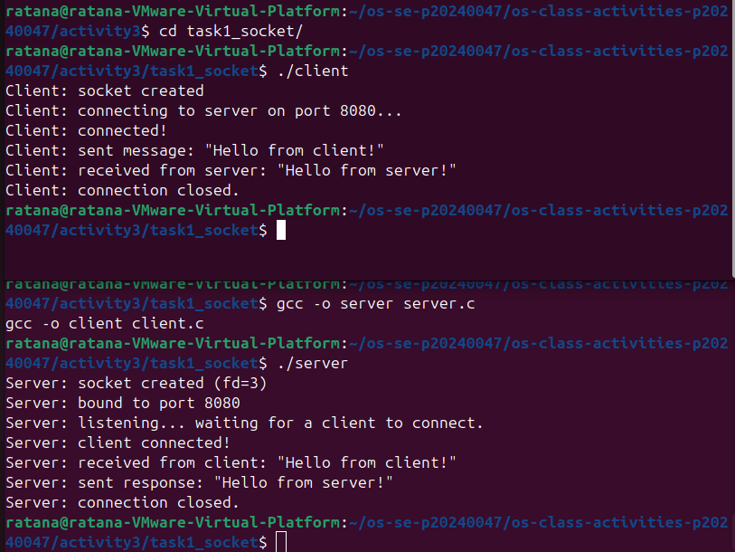
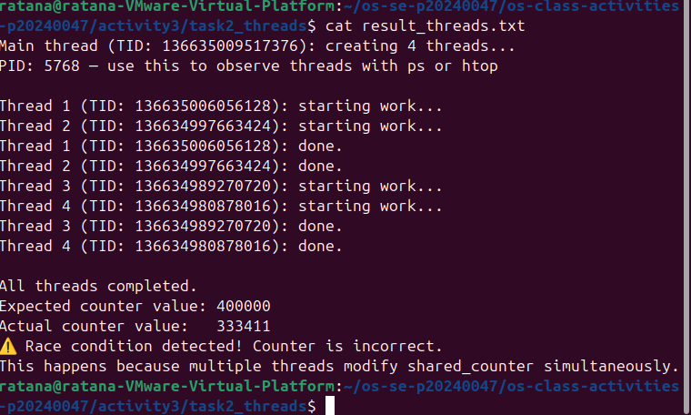
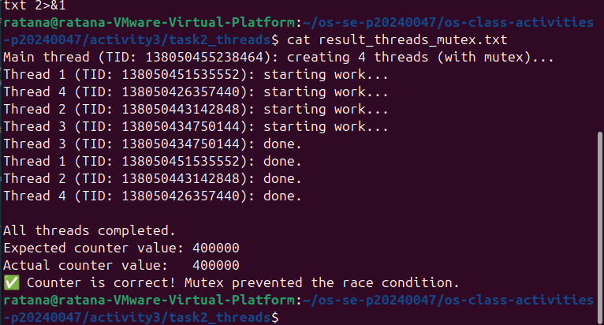
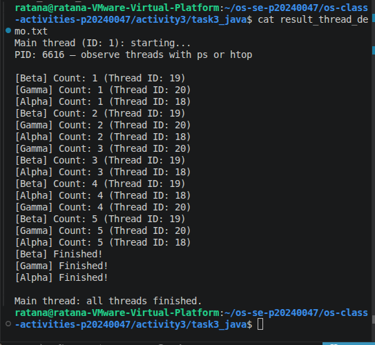
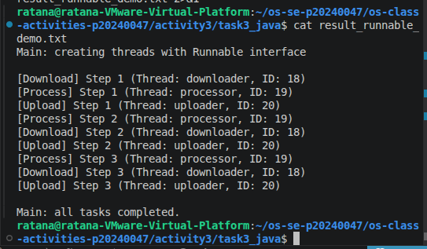
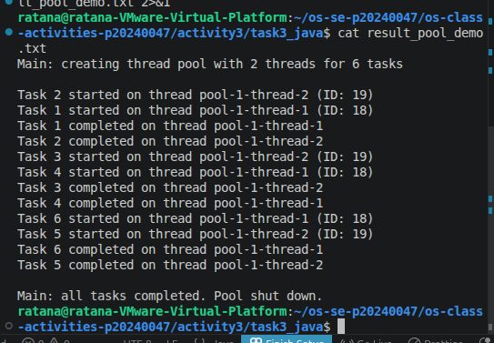
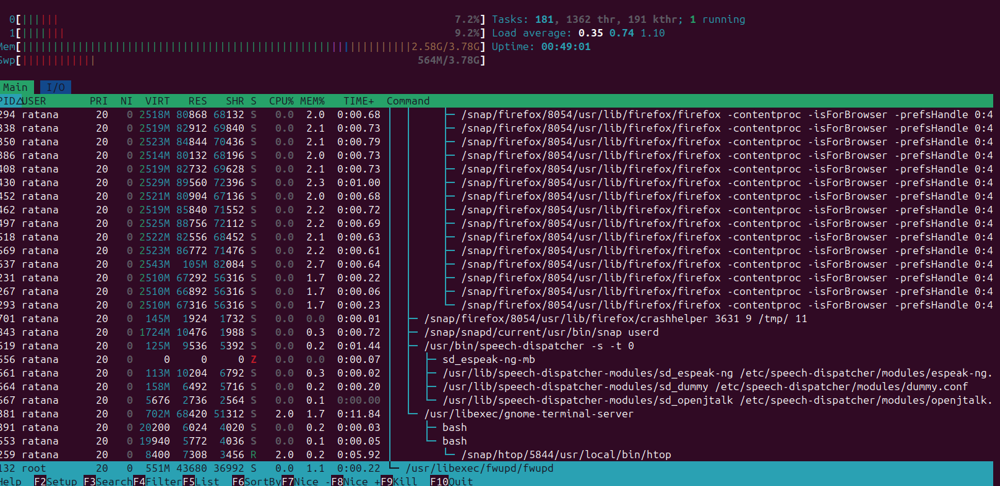
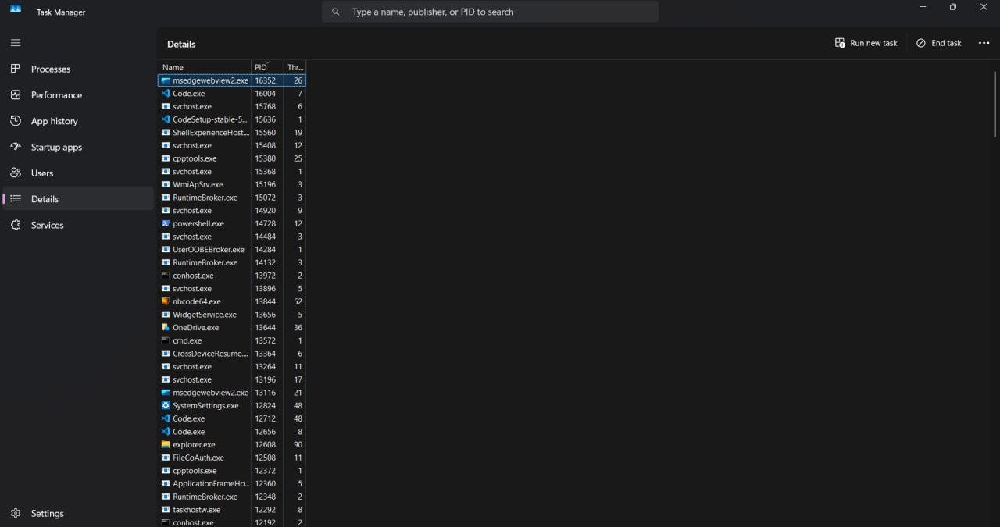

# Class Activity 3 — Socket Communication & Multithreading

- **Student Name:** PAV Ratana
- **Student ID:** p20240024


---

## Task 1: TCP Socket Communication (C)

### Compilation & Execution



### Answers

1. **Role of `bind()` / Why client doesn't call it:**
   > bind() attaches the server to a specific port so clients know where to connect and the client doesn't need to call it because the OS automatically assigns it a temporary port

2. **What `accept()` returns:**
   > accept() returns a new socket specifically for that client connection, while the original socket keeps listening for new ones.

3. **Starting client before server:**
   > The client will show failure with "connection refused" since there's nothing listening on that port yet

4. **What `htons()` does:**
   > htons() converts a port number to network byte order so different machines agree on the values

5. **Socket call sequence diagram:**

   ```
   SERVER                              CLIENT
    |                                   |
    socket() → fd=3                     socket()
    |                                   |
    bind() → port 8080                  |
    |                                   |
    listen()                            |
    |                                   |
    |                              connect() → port 8080
    |                                   |
    accept() <———— TCP Handshake —————  |
    |                                   |
    |                              send("Hello from client!")
    |                                   |
    recv() → "Hello from client!"       |
    |                                   |
    send("Hello from server!")          |
    |                                   |
    |————————————————————————————> recv() → "Hello from server!"
    |                                   |
    close()                             close()
    |                                   |
    "connection closed"              "connection closed"
    ```

---

## Task 2: POSIX Threads (C)

### Output — Without Mutex (Race Condition)



### Output — With Mutex (Correct)



### Answers

1. **What is a race condition?**
   > A race condition is when two threads read/modify the same variable at the same time and produce wrong results depending on timing

2. **What does `pthread_mutex_lock()` do?**
   > It blocks the thread until the mutex is free, then locks it which makes it so that only one thread run that section at a time

3. **Removing `pthread_join()`:**
   > The main thread would exit before the worker threads finish, likely killing them early and giving incomplete results
4. **Thread vs Process:**
   > Threads share the same memory space and are lighter weight; meanwhile, processes have separate memory and are more isolated but cost more to create.

---

## Task 3: Java Multithreading

### ThreadDemo Output



### RunnableDemo Output



### PoolDemo Output



### Answers

1. **Thread vs Runnable:**
   > When you extend Thread, your class is a thread, so it can't extend anything else but when you implement Runnable, you just define the task and pass it to a thread

2. **Pool size limiting concurrency:**
   > Extra tasks queue up and wait until a thread becomes free instead of all running at once, so the system doesn't get overwhelmed

3. **thread.join() in Java:**
   > It makes the main thread wait for that thread to finish before continuing

4. **ExecutorService advantages:**
   > It handles thread creation, reuse, and cleanup for you so you don't manage raw threads manually

---

## Task 4: Observing Threads

### Linux — `ps -eLf` Output

```
    sho        14045   13736   14045  0    5 18:55 pts/3    00:00:00 ./threads_observe
    sho        14045   13736   14047  0    5 18:55 pts/3    00:00:00 ./threads_observe
    sho        14045   13736   14048  0    5 18:55 pts/3    00:00:00 ./threads_observe
    sho        14045   13736   14049  0    5 18:55 pts/3    00:00:00 ./threads_observe
    sho        14045   13736   14050  0    5 18:55 pts/3    00:00:00 ./threads_observe
    sho        14101   13942   14101  0    1 18:56 pts/0    00:00:00 grep --color=auto threads_observe
```

### Linux — htop Thread View



### Windows — Task Manager



### Answers

1. **LWP column meaning:**
   > LWP is the kernel-level thread ID, each thread gets its own even though they share a PID

2. **/proc/PID/task/ count:**
   > Each folder in /proc/PID/task/ represents one thread, so the count equals your total thread count (main + workers)

3. **Extra Java threads:**
   > The JVM automatically creates background threads for garbage collection, JIT compilation, and other internal tasks on top of your own threads

4. **Linux vs Windows thread viewing:**
   > Linux gives you multiple low-level tools (ps, /proc, htop) with detailed thread info, while Windows Task Manager is simpler and more visual but shows less detail by default

---

## Reflection

> _What did you find most interesting about socket communication and threading? How does understanding threads at the OS level help you write better concurrent programs?_

> For me, the thing I found the coolest and most interesting is how the socket communication happens, it was so cool to see 2 terminals talking and communicating with each other. I think understanding threads at OS level made me understand the importance of being careful while writing concurrent programs as the kernel can switch threads at any moment