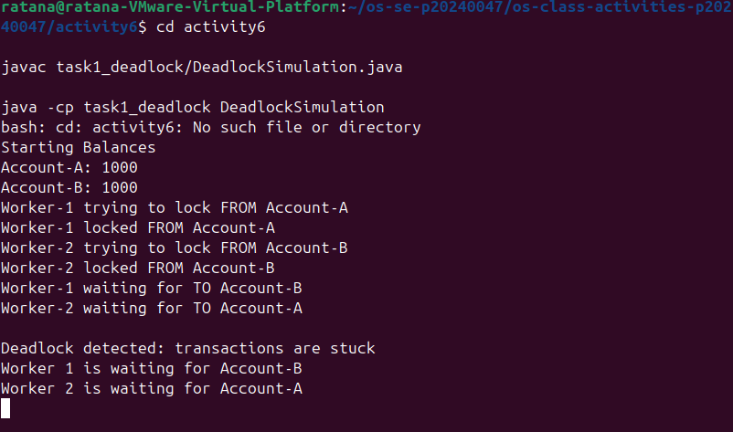
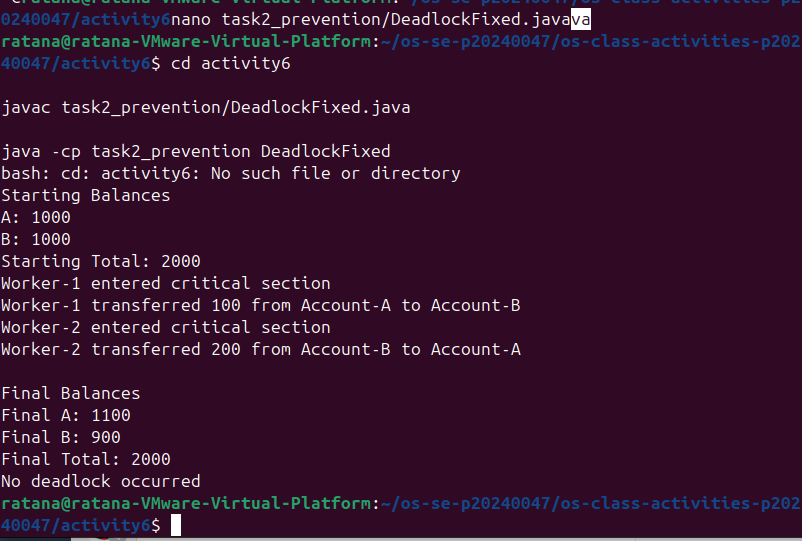

# Class Activity 6 - Deadlock Simulation

- **Student Name:** PAV Ratana
- **Student ID:** p20240047
- **Programming Language Used:** Java

---

## Task 1: Deadlock Version

Shared resources: Account-A and Account-B.
Transaction 1: Transfer 100 from Account-A to Account-B.
Transaction 2: Transfer 200 from Account-B to Account-A.
Deadlock message shown: "Deadlock detected: transactions are stuck".
Explanation of why the program got stuck: Worker-1 locked Account-A and then waited for Account-B. At the same time, Worker-2 locked Account-B and waited for Account-A. Since each worker was waiting for a lock held by the other worker, neither could continue, causing a deadlock.

---

## Task 2: Deadlock Prevention Version

Prevention strategy used: A single shared semaphore mutex was used to protect the entire transfer operation.
Semaphore mutex initial value: 1.
Starting total: 2000.
Final total: 2000.
Did both transfers complete? Yes.
Why no deadlock occurred: Only one thread could enter the transfer critical section at a time. This prevented threads from holding one resource while waiting for another, eliminating circular wait and preventing deadlock.

---

## Questions

1. What are the two shared resources in your bank transaction simulation?

The two shared resources are Account-A and Account-B.

2. Which line or section of your Task 1 program creates hold-and-wait?

The hold-and-wait condition occurs when a worker acquires the lock on the source account and then attempts to acquire the lock on the destination account while still holding the first lock.

3. How does Task 1 create circular wait?

Worker-1 waits for Account-B while holding Account-A, and Worker-2 waits for Account-A while holding Account-B. This creates a circular chain of waiting.

4. Why does the Task 1 program need a watchdog or timeout?

Without a watchdog or timeout, the program would appear to freeze indefinitely. The watchdog detects that no progress is being made and reports the deadlock condition.

5. How does the single semaphore mutex prevent deadlock in Task 2?

The semaphore allows only one thread to perform a transfer at a time. Since only one thread can enter the critical section, there is no possibility of two threads waiting on each other.

6. Which of the four deadlock conditions does your Task 2 solution remove or avoid?

The solution removes the circular wait condition and prevents the hold-and-wait situation by allowing only one transfer operation at a time.

7. Why must the final total bank balance remain unchanged after both transfers?

A transfer only moves money from one account to another. No money is created or destroyed, so the total balance across all accounts must remain constant.
---

## Reflection

_What did this activity teach you about deadlock prevention in real systems such as banking, databases, or file systems?_